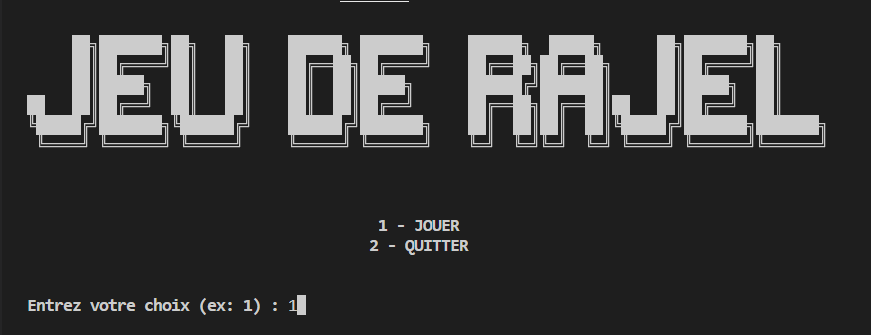
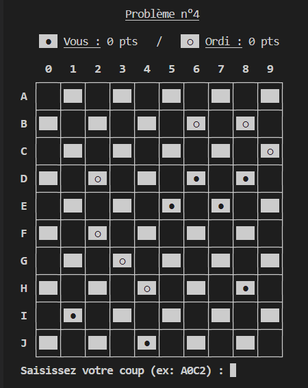
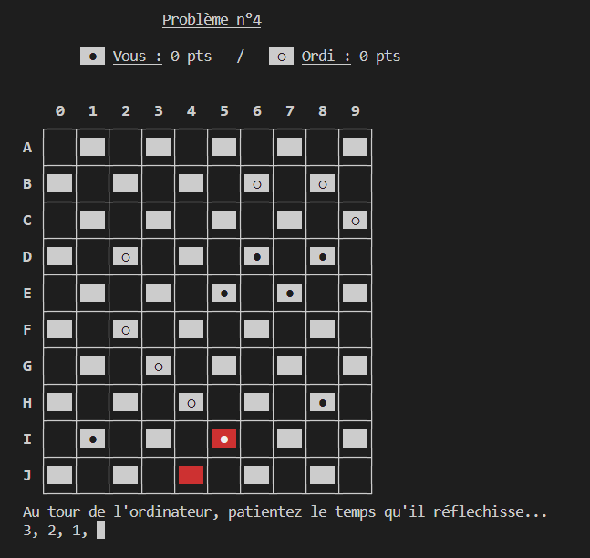
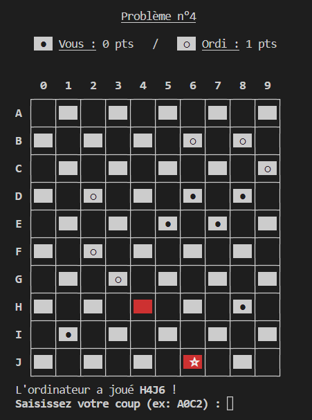
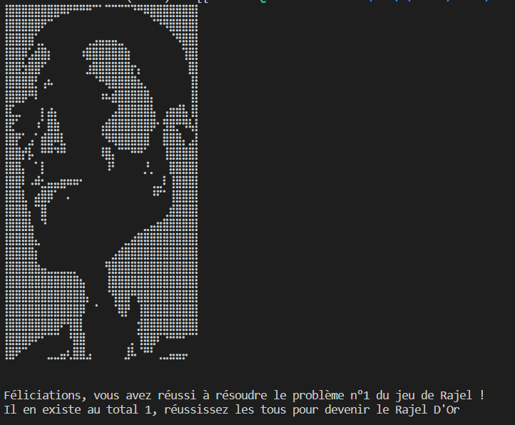

Jeu de Rajel
===========

Développé par **Anas OUHDDA** et **Amine AHMED BEY**

anas.ouhdda.etu@univ-lille.fr, amine.ahmedbey.etu@univ-lille.fr

# Présentation du Jeu de Rajel

Le but du jeu est de capturer toutes les pièces de votre adversaire, ou de le mettre dans une situation
l'empêchant de jouer.

Le **jeu de Rajel** se joue sur un plateau carré, divisé en **10 lignes** de **10 colonnes**, étant donné que les mouvements sont uniquement en diagonale, le plateau dispose de **50 cases actives**.

Le joueur affronte l'ordinateur, au lancement du jeu, une situation de problème à résoudre s'affiche, avec un certain nombre de pions appartenant au joueur ou à l'ordinateur (foncées ou claires), disposées sur le plateau. Ainsi, c'est au joueur de trouver la bonne combinaison pour résoudre le problème et gagner.

Les mouvements autorisés sont : **diagonale avant gauche** et **diagonale avant droite**, dans la limite d'une case par mouvement, ou deux si un adversaire est présent sur l'une d'elles.

Chaque pion qui touchera la dernière rangée de son adversaire se verra devenir un pion **RAJEL**, ce pouvoir lui permettra non seulement de pouvoir reculer et avancer, mais ceci **sans limite de cases** sauf si un plus de deux pions adverses collés gênent le passage.

.

.

.




*Le menu au lancement du jeu*

.

.

.




*L'attente du coup du joueur*

.

.

.




*Au tour de l'ordinateur*

.

.

.




*De nouveau au tour du joueur*

.

.

.




*La partie est terminée*

# Utilisation du Jeu de Rajel

Afin d'utiliser le projet, il suffit de taper les commandes suivantes dans un terminal :
```
./compile.sh
```
Permet la compilation des fichiers présents dans 'src' et création des fichiers '.class' dans 'classes'

```
./run.sh (aucun argument nécessaire)
```
Permet le lancement du jeu.